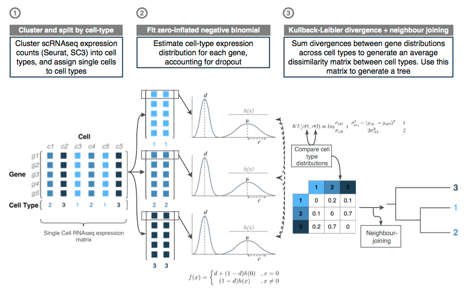

# TreeOfCells

An important challenge in analysing single cell RNA sequencing (scRNAseq) data
is the robust inference of trajectories between cell types. Current methods
assign cells across a continuous progression between end-point states. These
techniques, however, assume all cell types along the continuum are present in
the data, which, given their often transient nature, is unlikely. This program
attempts to adapt existing  phylogenetic models for use with scRNAseq data to
infer ancestral cell type trajectories where only discrete end-points are
available.

A zero-inflated negative binomial (ZINB) distribution is fitted to scRNAseq
expression data in order to generate a mean dropout rate (d), mean expression
level (mu), and dispersion (r) for each gene in a cell type. The
Kullback-Leibler divergence between distributions for the same gene between
cell-types is calculated and averaged across all genes to generate a pairwise
cell-type comparison. A tree topology is generated from these
pairwise-distances using the neighbour-joining inference method.

## Method

### Important Note:
This is an early proof-of-principle student project. Don't assume anything is 
bug free, correct, tested, or valid :)
